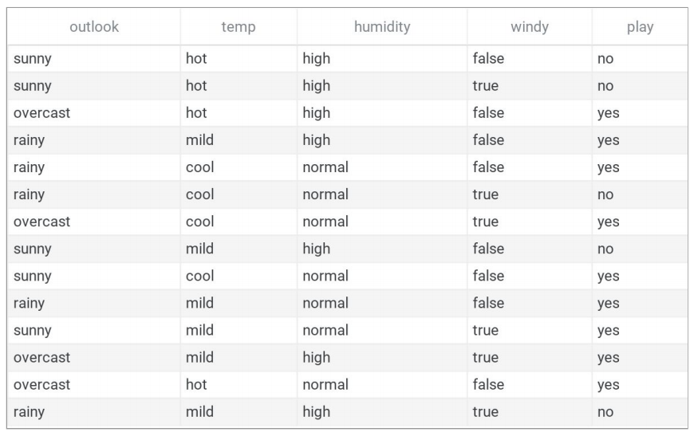

# Naive Bayes from Scratch

A simple implementation of the Naive Bayes Algorithm to understand its inner workings.

The dataset used here is the [Tennis Weather Dataset](https://www.kaggle.com/pranavpandey2511/naive-bayes-classifier-from-scratch) from Kaggle.

The completed Jupyter Notebook is available [here](https://colab.research.google.com/drive/1v9l0NN2SGH8iwsdw7_PKV22Wi4KDexAj?usp=sharing) or in the current repo.

Check the [PDF file](https://github.com/navendu-pottekkat/naive-bayes-from-scratch/blob/master/tennis_weather_naive_bayes_README.pdf) for complete description and walkthrough on how Naive Bayes was implemented.

